# INST767_Project_Team-6 Ercot and weather Energy Data Lake

## Team Details

| Name              |
|-------------------|
| Ushasri Bhogaraju |
| Aditya Kiran      |
| Shashank Ramprasad|
| Ashish Salunkhe   |
| Bingqi Lian       |

## Summary

Our Data pipeline ingests data from 5 APIs and loads it as is in cloud storage. Our workflow executes the relevant Pyspark jobs to pick up all the files in the cloud storage, transform the data to represent correct data types, removes nulls, duplicates, merged data where required, to populate the corresponding BigQuery tables.

## ELT Diagram

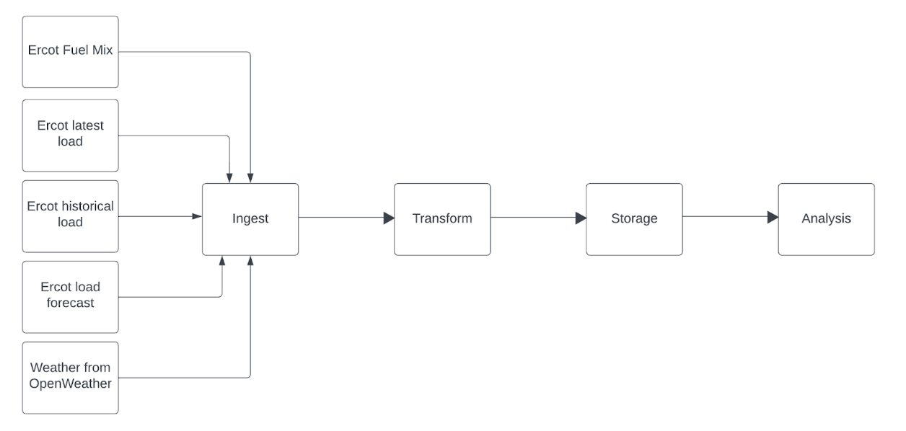

## Step 1: Storage Buckets

We created Storage Buckets to hold incoming data. Our data storage bucket is named ercot_test. It is structured to hold incoming CSV files into respective folders. The structure is available in the image below.

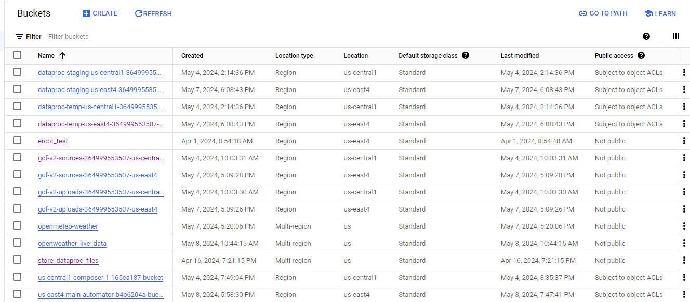

## Step 2: Cloud Functions

We created cloud functions that access data and save to the respective folders.

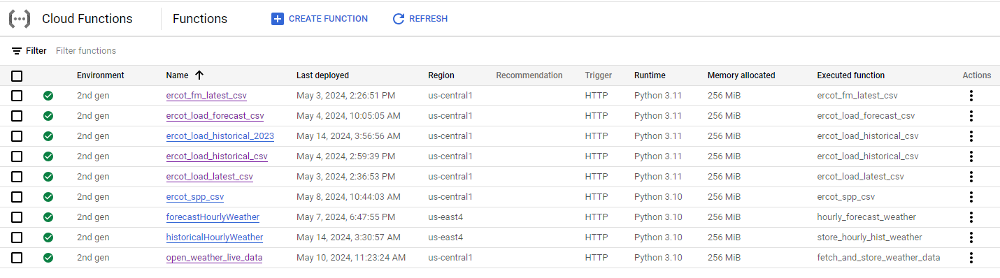

### Our Cloud Functions

We have 5 cloud functions to pull in data applying the following 4 methods on the gridstatus iso
iso =  gridstatus.Ercot()
* get_fuel_mix(),
* get_load(), (Source for 2 functions, one for load_latest and one for load_historical)
* get_load_forecast()
* Weather

Additionally, we created two more cloud functions that loads historical data upto the past 6 months:
* Ercot_load_historical_6m: This cloud function fetches the load information from ERCOT for the last 6 months and stores it in a bucket. 
* Store_hourly_hist_weather_6m: Similarly, this cloud function fetches the historical weather data from the last 6 months and stores it in a bucket.

## Step 3: Spark Jobs

We created Spark jobs that took the csv files, applied transformations such as

* Reading all the existing files in the folder and merging them into a single dataframe
* Transforming column names by replacing spaces with ‘_’ to suit updation to Bigquery
* The schema of the csv files was interpreted as strings by Pyspark. Therefore, we applied relevant transformations to correct the schema
* We corrected float numbers to 2 decimal places
* We deleted Nulls
* We iterated over all the CSV files in the source buckets, copying each one into an archive folder, before removing them from their original locations.
* Basic logging is also implemented to capture information such as the dataframe's shape and the presence of null values. These logging statements are helpful for debugging, monitoring the execution flow and understanding the data being transformed
* For the one pipeline that merges fuel mix and load data, we matched the data on the ‘Time’ column and removed only non-null rows

We saved the spark jobs code to our code storage bucket named store_dataproc_files. We have a code_notebooks folder in it, wherein we have the final_code folder which has Pyspark_code and cloud_functions code subfolders.  Its structure is as follows:

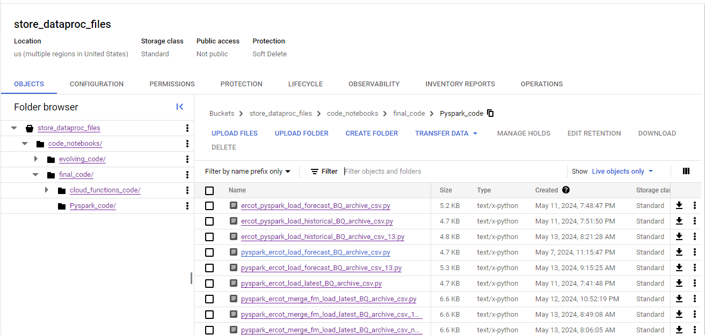

## Step 4: Dataproc Workflows

We then created Dataproc-Workflows, to create 4 distinct pipelines. They are:

* eda-wf-ercot-load-forecast -13: Executes the pyspark job related to reading all the files in the ercot_ load_corecast_csv folder, merging them into a single dataframe, apply transformations, update to bigquery and then move all the files to an archive. 
* ercot-load-hist-13: Executes the pyspark job related to reading all the files in the ercot_ load_csv/fm_historical folder, merging them into a single dataframe, apply transformations, update to bigquery and then move all the files to an archive. 
* ercot-merge-fm-load-13 : Executes the pyspark job related to reading all the files in the ercot_ load_csv/load_latest and ercot_fm_csv/fm_latest  folder, merging them into a single dataframe, apply transformations, update to bigquery and then move all the files to an archive. 
* Eda-wf-ercot-load-latest: Executes the pyspark job related to reading all the files in the ercot_ load_csv/load_latestl folder, merging them into a single dataframe, apply transformations, update to bigquery and then move all the files to an archive. 
* Workflow-spp-weather-merge : Executes the pyspark job which reads all the files in spp_latest folder that contains all the prices of fuels in 4 zones and quarter_hourly_weather_data folder that contains the weather data for the 4 zones. It then cleans and joins the two datasets on the location column(zones) and the time column.
* mergeHistoricalWeather.py : This pyspark job merges all the historical weather data that is fetched from the OpenMeteo API.
* pyspark_ercot_load_latest_BQ_archive_csv : Executes the pyspark job that reads all csv files from load_latest folder, merges them, transforms datatypes, updates big query table, archives the files and deletes from source folder. 

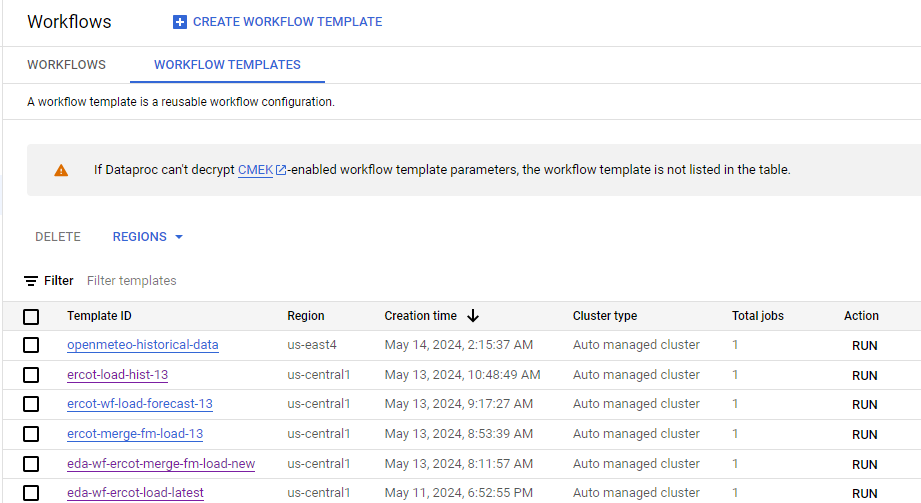

## BigQuery Data Pipeline with Cloud Scheduler

This document describes the strategy for ensuring only new files are processed by BigQuery and the Cloud Scheduler configuration for running the pipeline.

### Strategy for New File Processing

Instead of fetching specific files, the process involves:

1. Processing all files present in the designated bucket.
2. Moving processed files to an archive folder upon completion.

### Cloud Schedulers and Tasks

Cloud Schedulers are configured using cron jobs to trigger Cloud Functions and Dataproc cluster jobs at regular intervals.

**List of Schedulers:**

| Scheduler Name                 | Task Performed                                                | Frequency                                           |
|-------------------------------|--------------------------------------------------------------|----------------------------------------------------|
| `eda-wf-ercot-load-forecast`    | Executes ercot load historical workflow                        | Every 12 hours, at 00:00 (daily)                 |
| `eda-wf-ercot-load-hist`         | Executes ercot-load-hist-wf workflow                         | Every 12 hours, at 00:00 (daily)                 |
| `eda-wf-ercot-merge-fm-load`      | Executes ercot merge fuel mix and load latest workflow      | Every 12 hours, at 00:00 (daily)                 |
| `ercot-fm-latest`               | Executes ercot_fm_latest_csv cloud function                  | Every hour, at 15 past the hour (daily)        |
| `ercot-load-historical`        | Executes ercot_load_historical_csv cloud function            | Every hour, at 00:00 (daily)                       |
| `ercot-load-latest`             | Executes ercot_load_latest_csv cloud function                 | Every hour, at 15 past the hour (daily)        |
| `ercot_load_forecast`          | Executes ercot_load_forecast_csv cloud function              | Every hour, at 15 past the hour (daily)        |
| `Quarter_hourly_spp_csv`        | Executes ercot_spp_csv function                             | Every 15 minutes (hourly, daily)                    |
| `Quater_hourly_weather`        | Executes open_weather_live_data function                     | Every 15 minutes (hourly)                             |
| `Sparkjob-spp-weather-merge`     | Executes Spark job to merge SPP and weather data           | Every 12 hours                                       |

### Data Storage in BigQuery

After processing, data is loaded into BigQuery tables:

* `Ercot_fm_load_merged`
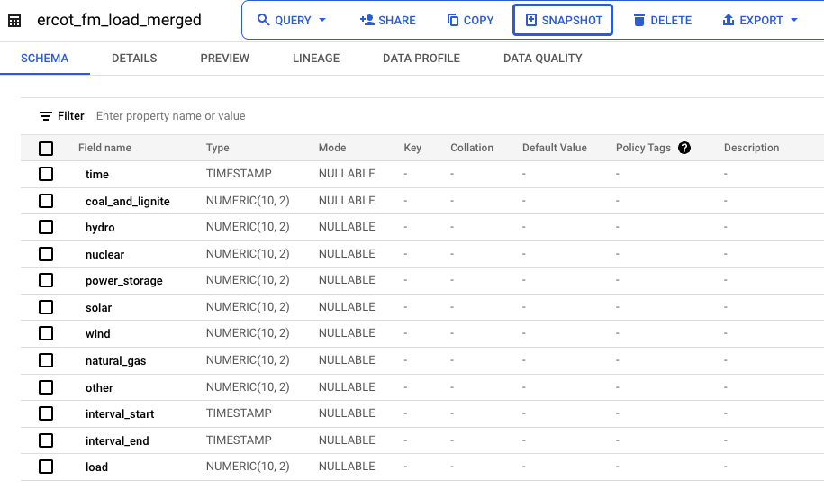
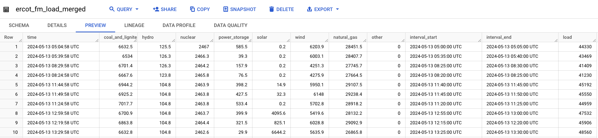

* `Ercot_load_forecast`
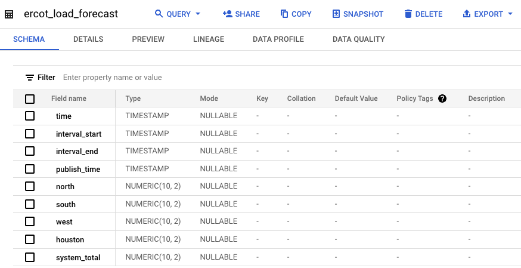
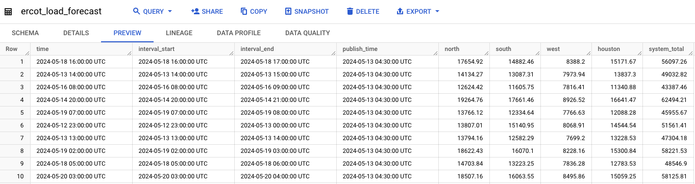

* `Ercot_load_historical`
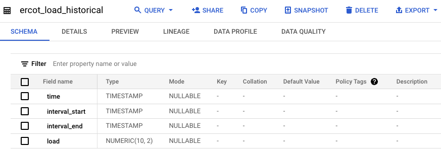
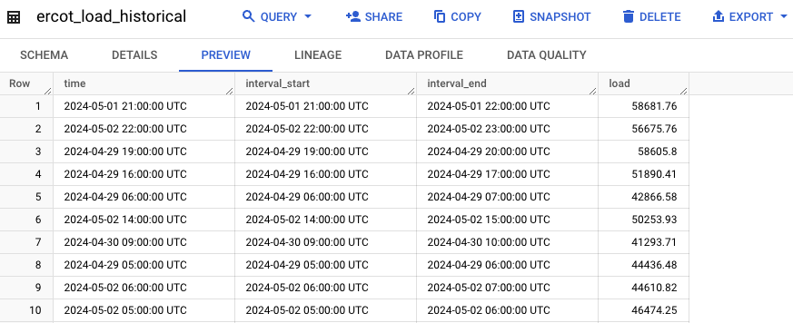

* `Ercot_load_latest`
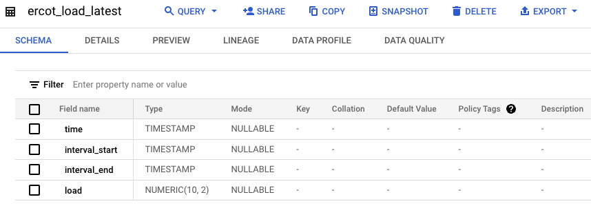
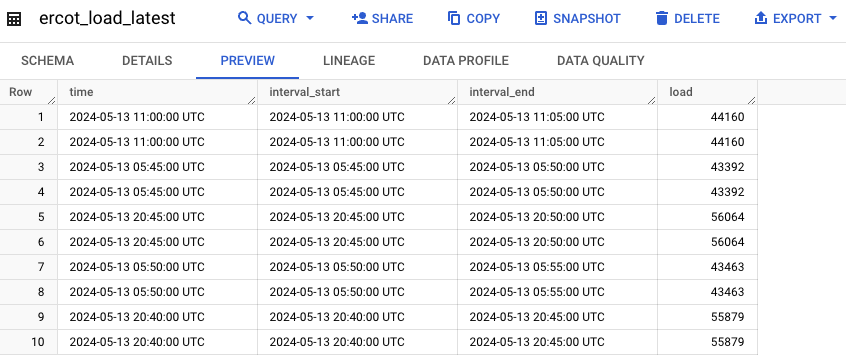

* `Ercot_spp_weather_merged`
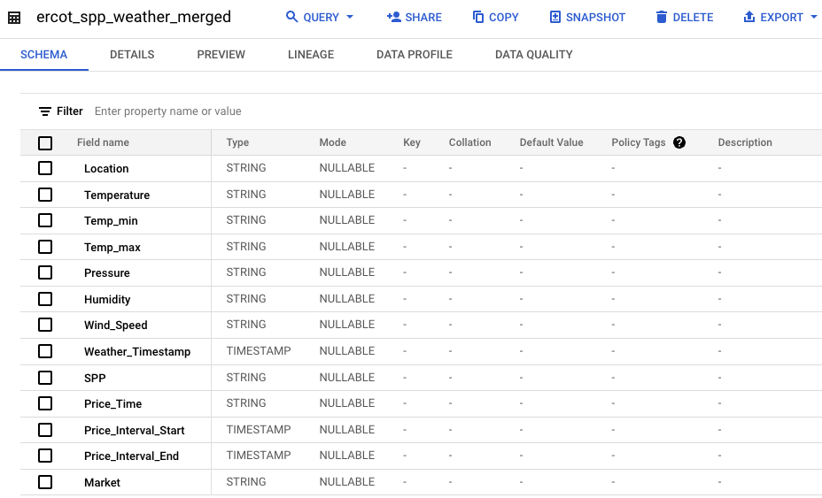
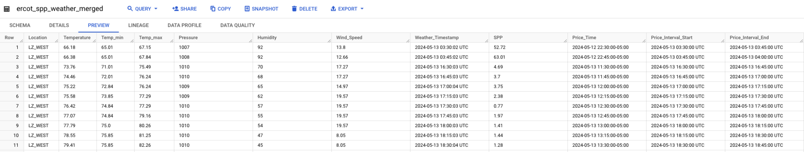

### Data Analysis with Looker

Queries are used to fetch data from BigQuery for business analysis. Visualizations are then created using Google Looker.

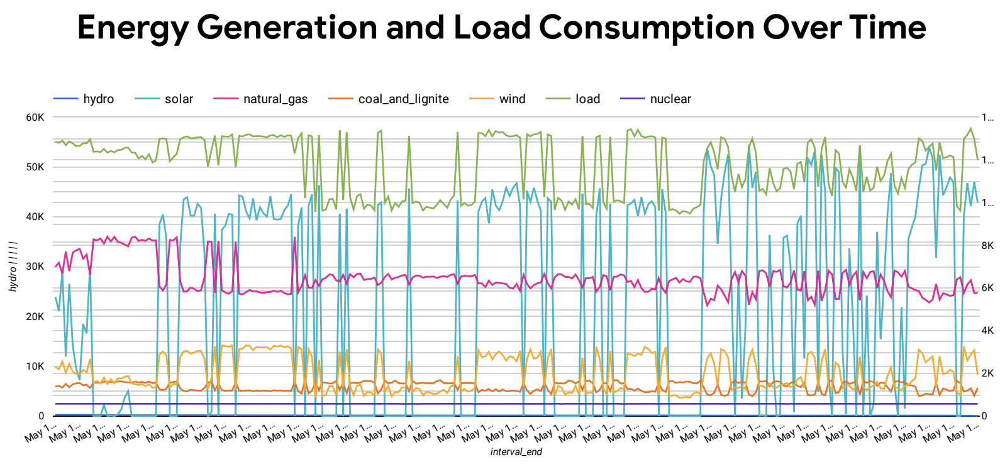 
### Queries

Business Question 1:

"What is the average energy consumption per month?"

Explanation:

"This query calculates the average energy consumption for each month by extracting the month from the timestamp INTERVAL_START and averaging the load values for each month. This analysis provides insights into the seasonal variation in energy consumption, which can be valuable for resource planning and demand forecasting."

Query:
SELECT 
    EXTRACT(MONTH FROM INTERVAL_START) AS month,
    AVG(load) AS average_load
FROM 
    ercot_merged.ercot_fm_load_merged
GROUP BY 
    month
ORDER BY 
    month;

Business Question 2:

"How does energy consumption vary throughout the day?"

Explanation:

"This query calculates the average energy consumption for each hour of the day by extracting the hour component from the timestamp INTERVAL_START and averaging the load values for each hour. Analyzing energy consumption patterns throughout the day can help identify peak usage hours, which are critical for grid management and capacity planning."

SELECT 
    EXTRACT(HOUR FROM INTERVAL_START) AS hour_of_day,
    AVG(load) AS average_load
FROM 
    ercot_merged.ercot_fm_load_merged
GROUP BY 
    hour_of_day
ORDER BY 
    hour_of_day;

Business Question 3:

"What is the percentage distribution of different energy sources in the overall energy mix?"

Explanation:

"This query calculates the percentage contribution of each energy source to the total energy mix. It divides the sum of each energy source by the sum of all energy sources (coal_and_lignite, hydro, nuclear, power_storage, solar, wind, natural_gas, and other), and then multiplies by 100 to get the percentage. Understanding the distribution of energy sources helps in assessing the reliance on different energy types and planning for a more diversified energy portfolio."

SELECT 
    ROUND(SUM(coal_and_lignite) / SUM(coal_and_lignite + hydro + nuclear + power_storage + solar + wind + natural_gas + other) * 100, 2) AS coal_and_lignite_percent,
    ROUND(SUM(hydro) / SUM(coal_and_lignite + hydro + nuclear + power_storage + solar + wind + natural_gas + other) * 100, 2) AS hydro_percent,
    ROUND(SUM(nuclear) / SUM(coal_and_lignite + hydro + nuclear + power_storage + solar + wind + natural_gas + other) * 100, 2) AS nuclear_percent,
    ROUND(SUM(power_storage) / SUM(coal_and_lignite + hydro + nuclear + power_storage + solar + wind + natural_gas + other) * 100, 2) AS power_storage_percent,
    ROUND(SUM(solar) / SUM(coal_and_lignite + hydro + nuclear + power_storage + solar + wind + natural_gas + other) * 100, 2) AS solar_percent,
    ROUND(SUM(wind) / SUM(coal_and_lignite + hydro + nuclear + power_storage + solar + wind + natural_gas + other) * 100, 2) AS wind_percent,
    ROUND(SUM(natural_gas) / SUM(coal_and_lignite + hydro + nuclear + power_storage + solar + wind + natural_gas + other) * 100, 2) AS natural_gas_percent,
    ROUND(SUM(other) / SUM(coal_and_lignite + hydro + nuclear + power_storage + solar + wind + natural_gas + other) * 100, 2) AS other_percent
FROM 
    `ercot_merged.ercot_fm_load_merged`;

Business Question 4:

"How does weather condition affect electricity prices?"

Explanation:

"This query calculates the average electricity prices (SPP) along with the associated weather conditions such as temperature, humidity, and wind speed. By examining the relationship between weather parameters and electricity prices, we can identify correlations and potential factors influencing price fluctuations."

Query:

SELECT 
    ROUND(AVG(SPP), 2) AS average_price,
    Temperature,
    Humidity,
    Wind_Speed
FROM 
    driven-stage-365620.ercot_merged.ercot_spp_weather_merged
GROUP BY 
    Temperature, Humidity, Wind_Speed
ORDER BY 
    average_price DESC;
